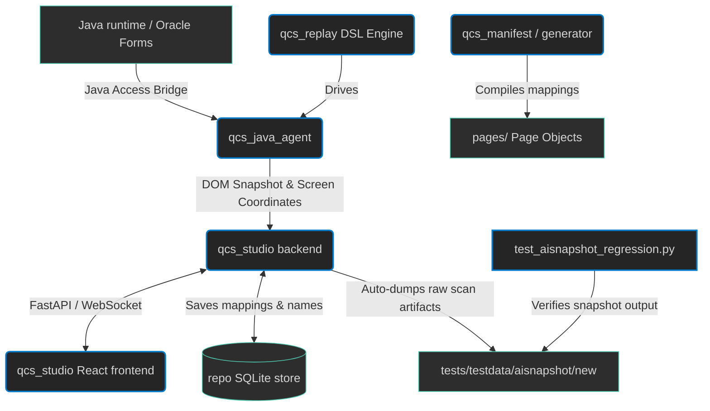

# Custom Workspace Rules & Architecture Guide

## 1. Custom Workspace Rules

- **No Grouping Folders (`FieldRow`)**: Do not use synthetic grouping folders (like `grp-1`, `grp-2`, etc. representing horizontal rows of fields) in the parsed scan tree. Row children must be appended flatly to their parent containers.
- **Table Row Grouping**: Ensure tables (especially large tables with >6 columns) are correctly recognized as `Table` nodes, grouping their cells into table rows using robust similarity signature matches (Jaccard similarity >= 70% with at least 3 matching columns).
- **Auto-Saving Scans**: Every scan performed via the web front-end must automatically dump its snapshot outputs into `tests/testdata/aisnapshot/new/<timestamp>/` (where `<timestamp>` is in `YYYYMMDD_HHMMSS` format) containing exactly 3 files:
  1. `ai_snapshot.txt`: The generated AI snapshot text.
  2. `java_scan_dump.json`: The raw JSON DOM returned from the Java scan.
  3. `screenshot.png`: The screenshot image.
- **Approved Folders**: Scans liked by the user should be manually moved from the `new` folder to the `approved` folder to become part of the regression test suite.
- **No Regression**: Every change to the scan or snapshot formatting code must run the regression test suite to ensure that the new code is able to reproduce the `ai_snapshot.txt` baselines from the `java_scan_dump.json` files under `tests/testdata/aisnapshot/approved/`.
- **No Buttons Grouping**: Do not group buttons under a synthetic `Buttons` group. Buttons must be appended flatly.
- **Dynamic Parent Bounds**: Ensure parent container nodes (like `Form`, `Table`, `Group`, etc.) enclosing children dynamically compute their bounds by enclosing all children's bounds recursively.

---

## 2. Application Architecture Overview

This project is an automation platform for Oracle Forms runtime applications, consisting of a Java accessibility agent scanner, an interactive repository editor studio, element storage, test replay engines, and automated script/page-object code generators.

### Component Directory Map

#### 📂 [qcs_java_agent](file:///C:/Apps/OracleAutomation/qcs_java_agent)
The Java Accessibility runtime interface that connects to active Java/Forms windows.
- [process.py](file:///C:/Apps/OracleAutomation/qcs_java_agent/process.py): Enumerates active Windows processes via ctypes to locate Oracle Forms runtime wrappers (`jp2launcher.exe`, `javaw.exe`), resolving PID, window handle (HWND), class name, and title.
- [driver.py](file:///C:/Apps/OracleAutomation/qcs_java_agent/driver.py): Executes lower-level control requests on Java GUI components (clicking, typing, triggering accessibility actions).
- [snapshot.py](file:///C:/Apps/OracleAutomation/qcs_java_agent/snapshot.py): **Core DOM parser & compiler**. Walks the JAB tree, partitions tab frames, applies row-sorting rules, uses similarity-based table column grouping, builds the tree layout metadata via `build_action_tree()`, recursively calculates bounding coordinates via `_populate_bounds()`, and generates the AI-friendly textual representation via `render_snapshot_text()`.
- [readiness.py](file:///C:/Apps/OracleAutomation/qcs_java_agent/readiness.py) / [settle.py](file:///C:/Apps/OracleAutomation/qcs_java_agent/settle.py): Monitors StatusBar messages and cursor types to wait for forms to settle into idle states prior to capturing visual snapshots.

#### 📂 [qcs_studio](file:///C:/Apps/OracleAutomation/qcs_studio)
A FastAPI web application serving the local web studio UI.
- [service.py](file:///C:/Apps/OracleAutomation/qcs_studio/service.py): Backend controller logic managing active scan caches (`ScanBundle`), capturing fullscreen screenshots, and writing automated scan output snapshots (`java_scan_dump.json`, `screenshot.png`, `ai_snapshot.txt`) to the tests directory on every scan.
- [web/](file:///C:/Apps/OracleAutomation/qcs_studio/web/src): React frontend allowing developers to view the screenshot, inspect the elements tree, verify the overlay box coordinates, and edit naming mapping entries in the element repository.

#### 📂 [qcs_repo](file:///C:/Apps/OracleAutomation/qcs_repo)
Element repository database storage layer.
- [store.py](file:///C:/Apps/OracleAutomation/qcs_repo/store.py) / [schema.py](file:///C:/Apps/OracleAutomation/qcs_repo/schema.py): SQLite storage backend saving the mappings.
- [fingerprint.py](file:///C:/Apps/OracleAutomation/qcs_repo/fingerprint.py): Calculates layout hashing and forms structural fingerprints to uniquely identify window layouts.

#### 📂 [qcs_replay](file:///C:/Apps/OracleAutomation/qcs_replay)
Automation test execution engine.
- [java_agent.py](file:///C:/Apps/OracleAutomation/qcs_replay/java_agent.py): Replay target driver translating script DSL steps (clicks, inputs) into lower-level `driver.py` invocations.
- [dsl.py](file:///C:/Apps/OracleAutomation/qcs_replay/dsl.py): Replay DSL keyword commands definition.

#### 📂 [generator](file:///C:/Apps/OracleAutomation/generator) & [qcs_manifest](file:///C:/Apps/OracleAutomation/qcs_manifest)
- Converts element repository mappings into standard Python Page Object classes (`pages/*.py`), and validates test manifests against schemas.

#### 📂 [tests](file:///C:/Apps/OracleAutomation/tests)
- [test_aisnapshot_regression.py](file:///C:/Apps/OracleAutomation/tests/test_aisnapshot_regression.py): Discovers all subdirectories under `testdata/aisnapshot/approved/`, parses their raw `java_scan_dump.json`, and asserts that the compiler output exactly matches the baseline `ai_snapshot.txt`.
