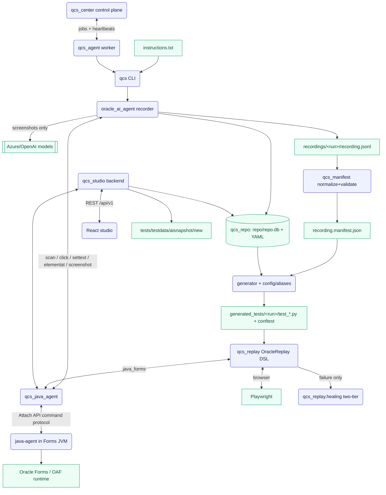

# GitHub Copilot Instructions — QCS Oracle Automation

Guidance for GitHub Copilot and other AI coding agents working in this repository.
This file is kept identical to `.agents/AGENTS.md`; edit both together, and keep
them in sync with the visual companion `architecture.html`.

> **Mission.** QCS records natural-language Oracle EBS R12 test instructions once,
> then generates deterministic, AI-free pytest replay scripts for mixed OAF/web
> and Java Forms flows. A separate **web studio** lets a human capture and curate
> the element repository that those scripts resolve against.
>
> **AI boundary.** AI is an *authoring and repair* assistant only — it is allowed
> during recording and after a deterministic replay failure (healing). **Normal
> replay must never call an LLM.** During recording, AI sees screenshots only; the
> Java DOM stays local and is mapped to elements by deterministic code.

---

## 1. Custom Workspace Rules

These constraints govern the scan → snapshot → tree pipeline in
`qcs_java_agent/snapshot.py` and the web studio in `qcs_studio/`. Follow them
exactly; several are guarded by the regression suite.

- **Metadata-driven table grouping.** Tables are assembled from the Java agent's
  schema-2.0 identity metadata (`recordIndex` + `columnKey`), **not** from
  geometry or label similarity. `_grid_node()` builds a `Table` node purely from
  `recordIndex`/`columnKey`; a real grid needs ≥2 distinct columns (guards against
  a stray single-column `GridCell`). Do **not** reintroduce the old
  Jaccard/geometric row-signature heuristic — it has been removed.
- **Flat rows and buttons.** Do not wrap fields in synthetic horizontal
  grouping folders, and do not group buttons under a synthetic `Buttons` folder.
  Row and button children are appended flatly to their parent container.
- **Dynamic parent bounds.** Container nodes (`Form`, `Table`, `Group`, tab
  content, etc.) compute their bounds by enclosing all descendant bounds
  recursively. Never hard-code container geometry.
- **Auto-saving scans (studio).** When the studio computes a tree
  (`StudioService.compute_tree`, reached via `POST /api/v1/scan/recalculate`),
  it auto-dumps the raw artifacts to
  `tests/testdata/aisnapshot/new/<YYYYMMDD_HHMMSS>/`:
  1. `ai_snapshot.txt` — the generated AI snapshot text.
  2. `java_scan_dump.json` — the raw JSON DOM returned by the Java scan.
  3. `screenshot.png` — the captured screenshot.
  Multi-tab scans additionally dump per-tab `java_scan_dump_<tab>.json` and a
  `tab_screenshots/` folder.
- **Approved baselines.** Scans a human likes are moved by hand from
  `tests/testdata/aisnapshot/new/` to `tests/testdata/aisnapshot/approved/` to
  join the regression suite.
- **No snapshot regression.** Any change to scan or snapshot-formatting code must
  keep `tests/test_aisnapshot_regression.py` green. That test runs
  `build_action_context()` over every `java_scan_dump.json` under
  `approved/` and asserts the output matches the checked-in `ai_snapshot.txt`
  **exactly**. Fix the code or deliberately re-approve the baseline — never let it
  drift silently.

### System-wide rules (recording, replay, safety)

- **Forms launch sequence.** After EBS login succeeds, call `oracle_form_open`
  immediately — it handles responsibility selection and function navigation
  internally. Do not navigate responsibilities or menus first. If `RF.jsp`
  downloads a JNLP or starts Forms, call `java_form_launch` immediately before any
  Java Forms interaction.
- **No screenshot clicking in normal Forms replay.** Java Forms actions go through
  `java-agent/` via `qcs_java_agent`, not pixel clicking. Screenshot/computer-use
  is reserved for the recorder and the Tier-2 healer.
- **No AI in the normal replay path.** Do not import or call LLM modules from the
  deterministic replay path. `tests/test_oracle_replay_dsl.py` contains a guard
  (`test_replay_dsl_module_does_not_import_ai_modules`) — keep it passing.
- **Business-readable generated scripts only.** Generated `form_ref`/`element_ref`
  arguments must be business names. Never emit `java_*`, `_alt_*`, `_mnemonic_*`,
  `toolbar\d`, `page.locator(...)`, or raw Java descriptor dicts in the step
  section. `qcs gen validate <dir>` enforces this.
- **Don't hand-edit generated artifacts.** Lasting fixes go in `generator/`,
  `qcs_replay.script`, the alias catalog, or repository metadata — never in
  `generated_tests/`, generated `pages/`, or generated `flows_gen/`.
- **Never serialize secrets.** No credentials, Azure keys, or tokens in prompts,
  logs, DB rows, recordings, generated tests, docs, or reports.

---

## 2. Architecture Overview

Two cooperating subsystems share one object repository:

1. **Record → generate → replay pipeline** (CLI-driven): capture a flow once with
   AI assistance, normalize it to a validated manifest, update the actioned-element
   repository, and generate a deterministic pytest suite that replays without AI.
2. **QCS Studio** (web-driven): a local FastAPI + React app to scan a live Oracle
   Forms window, review the screenshot/element overlay, curate the element tree,
   and persist reusable containers into the same repository.



---

## 3. Component Directory Map

### `qcs/` — CLI entry point
`qcs/__main__.py` (`python -m qcs …`) registers all commands and dispatches to the
owning module. Command groups:

| Command | Dispatches to | Purpose |
|---|---|---|
| `record <instr> --run-id <id> [--data] [--auto-name]` | `oracle_ai_agent.run_agent` + `generator.build_pages` + `generator.build_test` | Record a flow, update repo, regenerate pages, and generate the replay suite. |
| `play <instr> --run-id <id>` | `oracle_ai_agent.play.run_play` | Screenshot-only computer-use "play" mode (does not write `recording.jsonl` or touch the repo). |
| `normalize <recording>` | `qcs_manifest.normalize_recording` | `recording.jsonl` → validated `recording.manifest.json`. |
| `gen run <recording> <test_name>` | `generator.build_test.generate_test` | Regenerate a pytest suite from a recording/manifest. |
| `gen validate <dir>` | `generator.script_validator.validate_generated_dir` | Business-readability gate on generated tests. |
| `pages [form_ids…]` / `flows [flow_ids…]` | `generator.build_pages` / `build_flows` | Regenerate page objects / flow functions from the repo. |
| `aliases validate` / `aliases report` | `generator.alias_catalog.AliasCatalog` | Validate / summarize the alias catalog. |
| `repo validate` | `qcs_repo.store.validate_repo` | Validate all `repo_entries`. |
| `repo-capture <form_id> <snapshot_db>` | `qcs_repo.store` | Import a recording snapshot DB into the element catalog. |
| `center` / `agent` | `qcs_center.app` / `qcs_agent.main` | Start the control-plane API / a worker (optional extras). |

### `oracle_ai_agent/` — AI-guided recorder
- `tools.py`: `RecorderSession` state and the tool surface the model calls —
  `session_start`, `ebs_login`, `oracle_form_open`, `java_form_launch`,
  `java_click`, `java_send_text`, `java_get_page_snapshot`, etc. `dispatch()`
  routes model tool-calls; every action is appended to
  `recordings/<run>/recording.jsonl`. Java-agent results are mapped to repo
  elements via `qcs_java_agent.snapshot`.
- `play.py`: deterministic login + form-open, then a GPT computer-use loop that
  drives the Forms window by screenshot + `pyautogui` (window-relative → screen
  coordinate mapping). Used by `qcs play`.
- `cu_system_prompt.txt`: the stable computer-use system prompt.

### `qcs_java_agent/` — Python client to the Java agent
`JavaAgentDriver` (`driver.py`) attaches to a Forms JVM and runs the agent command
protocol. Command vocabulary: `health`, `scan`, `raw`, `layout`, `tables`,
`focus`, `click`, `settext`, `clear`, `presskey`, `screenshot`, `highlight`,
**`elementat` (point hit-test → `element_at(x, y)`)**.
- `snapshot.py`: **core DOM parser/compiler.** `active_window_scan()` scopes to the
  active window/dialog; `flatten_nodes()`/`java_nodes_to_repo_elements()` produce
  repo element dicts (each carrying screen-absolute bounds, role, name, schema-2.0
  `semantic_id` + `primaryLocator`); `build_action_tree()` → `build_action_context()`
  → `build_action_payload()` produce the curated tree + AI snapshot text;
  `actioned_element_at(scan, x, y)` and `build_full_overlay_elements()` support
  coordinate hit-testing and the studio overlay; `merge_scans()` merges multi-tab
  DOMs. (The old `render_snapshot_text`/`_build_action_tree` symbols are gone.)
- `readiness.py` / `settle.py`: poll `scan()` until the form is structurally stable
  and not busy before capturing snapshots. Avoid fixed sleeps.
- `attach.py` / `command.py` / `process.py`: build and run the Attach API command,
  and discover the Forms process (`jp2launcher.exe` / `javaw.exe` → PID → HWND).

### `java-agent/` — Java Attach API agent (runs inside the Forms JVM)
Maven project under `java-agent/src/main/java/com/pyebsdom/agent/`. Loaded via
`EbsDomAgent.agentmain()`; `dispatch()` switches on the command name.
- `DomScanner.java`: walks the AWT/Swing tree, emitting screen-absolute bounds and
  Oracle schema-2.0 identity (`semanticId`, `primaryLocator`, `containerRole`,
  `ownerTab`, `recordIndex`, `columnKey`, `treePath`, `isMirror`).
- `ActionExecutor.java`: `executeClick/SetText/Clear/PressKey/Focus`,
  `executeScreenshot` (full screen or component region), `executeHighlight`, and
  `executeElementAt` (`findDeepestRealComponent` recursion → component at a screen
  point).
- Rebuild after Java changes:
  `& 'C:\apache-maven-3.9.15\bin\mvn.cmd' -f java-agent\pom.xml -DskipTests package`.

### `qcs_repo/` — object repository
SQLite `repo/repo.db` is the source of truth (tables `forms`, `elements`,
`containers`, `container_elements`, `repo_entries`); YAML under `repo/` is the
review/export/fallback format.
- `schema.py`: `RepoEntry` dataclass keyed by `(form_ref, element_ref)` with
  `descriptor`, `fallback_descriptors`, `surface`, `source`, `confidence`,
  `status`; `validate_entry` / `validate_repo`.
- `identity.py`: stable identity — `semantic_ref`, `element_uid`,
  `element_identity_key` (ignores volatile `eNN` refs), `locator_candidates`.
- `store.py`: `save_form_capture` (full inventory, preserves human names),
  `upsert_actioned_element` (records only interacted elements),
  `upsert_form_module`, `save_container_scan`, `load_entry`, `resolve_element_ref`.
- `fingerprint.py`: `fingerprint_java_form` / `fingerprint_html_page` →
  stable `java_*` / `html_*` `form_id`s.

### `qcs_manifest/` — normalized manifest layer
`RecordingManifest` / `RecordingManifestStep` (`model.py`). Canonical step fields:
`step_id`, `intent`, `surface` (`browser` | `java_forms` | `system` | `assertion`),
`action`, **`form_ref` + `element_ref`** (there is no `target_ref` anywhere),
`input`, `assertions`, `diagnostics`, `metadata`. `normalize.py` converts
`recording.jsonl` → manifest; `validate.py` + `schema.py` enforce the contract
(guarded by `tests/test_manifest_layer.py`).

### `generator/` + `config/aliases/` — deterministic code generation
- `build_test.py`: manifest → `test_<name>.py` + `conftest.py` using the
  `OracleReplay` / `FormReplay` DSL. `build_pages.py` / `build_flows.py` regenerate
  page objects and flows.
- `naming.py`: `sanitize_ref()` strips technical noise; `AliasResolver` resolves
  business names, returning `NameResult` (confidence + `needs_alias_review`).
- `alias_catalog.py`: `AliasCatalog` / `FormAliasFile` / `ElementAlias` load
  per-domain JSON at `config/aliases/<domain>/<form_ref>.json`
  (`order_management`, `purchasing`, `common`) and `validate()` for conflicts.
- `script_validator.py`: post-generation gate flagging `java_*`, `toolbar\d`,
  `_alt_*`, `_mnemonic_*`, `page.locator(`, and raw Java descriptor dicts.

### `qcs_replay/` — deterministic replay runtime (AI-free)
- `script.py`: public `OracleReplay` facade — `login`, `open_form`, `form(form_ref)`
  (→ `FormReplay`), `step`, `press_key`.
- `dsl.py`: `RepositoryResolver` (→ `ResolvedTarget`, raises `ReplayRefNotFoundError`
  on miss — no silent fallback), `FormReplay` handle (`click`, `double_click`,
  `set_text`, `select_value`, `press_key`, `wait_for`, `assert_visible`,
  `assert_text`, `assert_value`, `get_text`, `get_value`), backends
  `BrowserReplayBackend` (Playwright) and `JavaFormsReplayBackend`, surface routing
  by `form_id` prefix (`html_` → browser, `java_` → java_forms), `ReplayLogger`,
  typed exceptions.
- `web.py` / `java_agent.py`: Playwright login+form-open helpers; DSL-step →
  `JavaAgentDriver` translation.
- `locator.py` / `assertions.py` / `data.py`: locator strategy chains, retry-poll
  assertions, Excel/CSV data loaders.
- `failure_bundle.py`: `BundleWriter` writes `failure_bundle.json` + screenshot +
  Java snapshot on step failure — **no repo mutation, no AI.**
- `healing/`: two-tier, **failure-only** self-healing. `engine.py` runs the action,
  and only on exception escalates Tier 1 `SnapshotHealer` (accessibility snapshot →
  constrained LLM → validate) → Tier 2 `ComputerUseHealer` (screenshot → computer
  use → `coord_to_locator`). Successful heals write a reviewable `repo_patch.yaml`.

### `qcs_studio/` — web repository studio (backend + React frontend)
FastAPI backend (`app.py`, `router.py`, `service.py`, `models.py`). All API routes
are under `/api/v1` (optional bearer auth via `QCS_STUDIO_API_KEY`):

| Route | Purpose |
|---|---|
| `GET /windows` | List running Oracle Java processes to scan. |
| `POST /scan` | **Phase 1** — attach, capture raw DOM + screenshot (multi-tab DFS), return a `ScanBundle` with an empty tree. |
| `POST /scan/recalculate` | **Phase 2** — build tree + AI snapshot + overlay from cached raw DOM; auto-dump artifacts. |
| `POST /scan/save` | Persist a draft scan as a container (status `active`). |
| `GET /scans/{id}/screenshot` | Screenshot for a draft (supports `?tab=`). |
| `GET /containers` · `GET /drafts` · `GET /drafts/{id}` · `DELETE /drafts/{id}` | List/inspect/delete containers and drafts. |
| `GET/PUT /containers/{ref}` · `PUT /containers/{ref}/display-tree` | Load / update a container / persist the curated display tree. |
| `PATCH/DELETE /containers/{ref}/elements/{ref}` | Edit / remove a single element. |

`ScanBundle` (`service.py`) holds `raw_dom`, `snapshot_text`, `tree`, `raw_elements`,
`full_elements` (hoverable overlay boxes), `screenshot_path`, multi-tab
screenshots/DOMs, and `capture_mode`.

**Frontend** (`qcs_studio/web/`, React 18 + TypeScript + Vite; `src/App.tsx`):
renders the screenshot with an overlay of element bounding boxes, hover-to-highlight
with a details tooltip (`element_ref`, name, type, role, value, actions), two hover
modes (`tree` vs `all`), zoom/fit, an expandable element tree, and **drag-to-add**:
"discovery" elements not yet in the tree are dragged onto tree nodes
(`addElementToNode`) and persisted via `PUT …/display-tree`. Today the studio works
off a captured screenshot + overlay — there is no live cursor picking on the real
Forms window yet, and no WebSocket. (See `architecture.html` → "Studio Enhancement:
Live Element Picker" for the planned upgrade built on the existing `elementat`,
`screenshot`, and `highlight` commands.)

### `qcs_center/` + `qcs_agent/` — control-plane prototype
`qcs_center` is an early FastAPI + SQLite job/agent service (`POST /api/v1/jobs`,
`/agents/poll` long-poll, `/agents/heartbeat`, `/agents/result/{id}`).
`qcs_agent` is the Windows worker: `qcs_agent/loop.py` long-polls the center and
`executor.py` shells out to `python -m qcs record …`, posting results back. Both are
prototypes — evolve them into full record/generate/replay/artifact orchestration.

### `tests/`
`pytest` suite covering the manifest layer, repo entries, DSL routing, generator
naming, script validation, healing/failure bundles, settle/readiness, and the
snapshot golden regression (`test_aisnapshot_regression.py`,
`test_semantic_tree_golden.py`).

---

## 4. Local Commands

```powershell
# Record a flow and generate its replay suite
python -m qcs record instructions.txt --run-id rec_014 --auto-name

# Replay (no AI)
python -m pytest generated_tests\rec_014 -q -s

# Regenerate + gate an existing recording
python -m qcs gen run recordings\rec_013 rec_013_replay --out generated_tests\rec_013_replay
python -m qcs gen validate generated_tests\rec_013_replay

# Catalog + repo validation
python -m qcs aliases validate
python -m qcs repo validate

# Fast local checks
python -m compileall qcs oracle_ai_agent qcs_java_agent qcs_repo qcs_replay generator
python -m pytest tests/ -q

# Web studio (local)
python -m qcs_studio            # FastAPI backend
cd qcs_studio/web && npm install && npm run dev   # React frontend (proxies /api → backend)

# Rebuild the Java agent after Java changes
& 'C:\apache-maven-3.9.15\bin\mvn.cmd' -f java-agent\pom.xml -DskipTests package
```

---

## 5. Where To Put Changes

| Change | Owning layer |
|---|---|
| Recorder behavior / AI recording | `oracle_ai_agent/` |
| Java Forms extraction & replay | `java-agent/` + `qcs_java_agent/` |
| Scan → tree / snapshot formatting | `qcs_java_agent/snapshot.py` (+ approve baselines) |
| Repository identity, naming, patches | `qcs_repo/` |
| Manifest contract | `qcs_manifest/` |
| Generated-script behavior & naming | `generator/`, `config/aliases/`, `qcs_replay.script` |
| Runtime locators, assertions, healing | `qcs_replay/` |
| Web studio (capture, tree curation, picker) | `qcs_studio/` (backend + `web/`) |
| Fleet / jobs / artifacts | `qcs_center/`, `qcs_agent/` |

See `docs/project-guide.md` for the full team handoff and `architecture.html` for
the visual companion.